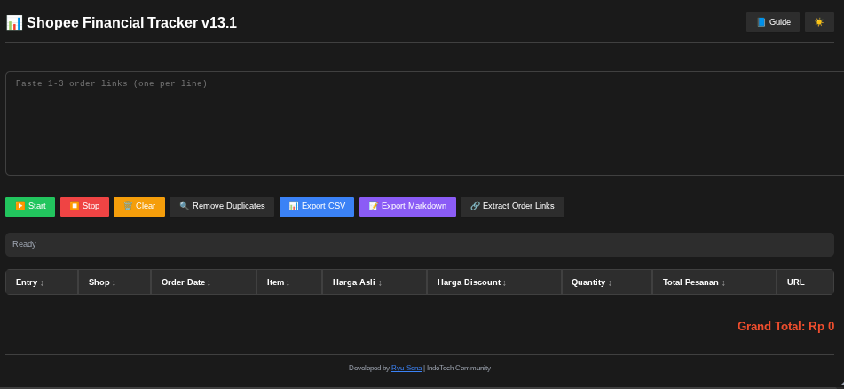
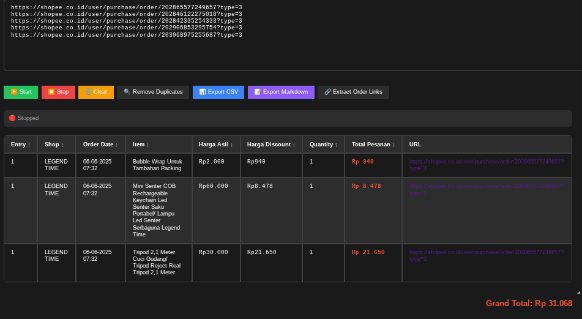
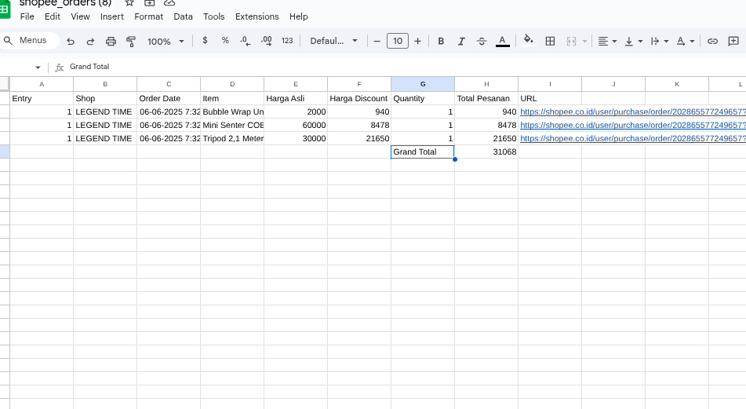

# Shopee Financial Tracker

Formerly know as Shoppe Quick Report

A powerful browser extension to track and analyze your Shopee purchases with comperhensive financial reporting.
- [Untuk Panduan dan toturial bahasa indonesia silahkan klik disini](#Shopee-Financial-Tracker)
## Features

- 📊 **Comprehensive Financial Tracking**
  - Track product Original Price and discount
  - Track Date of order
  - Track Quantity of item
  - Calculate Grand Total of order

- 🎨 **Modern UI/UX**
  - Clean and intuitive interface
  - Dark/Light mode support
  - Draggable and resizable window
  - Real-time status updates
  - Beautiful notifications

- 📈 **Advanced Export Options**
  - CSV export with Excel optimization
  - Markdown export for documentation
  - Proper currency formatting
  - Organized data structure

- 🔄 **Smart Features**
  - Automatic order link extraction
  - Duplicate detection and removal
  - Smart retry mechanism
  - Popup handling
  - Anti CAPTCHA detection
 
## Image

## Installation

1. Install a userscript manager:
   - [Tampermonkey](https://www.tampermonkey.net/) (Recommended)
   - [Violentmonkey](https://violentmonkey.github.io/)
   - [Greasemonkey](https://www.greasespot.net/)

2.  Instalation 
   -  Instal through [GreasyFork](https://greasyfork.org/en/scripts/540269-shopee-financial-tracker) or
   -  Github [Release](https://github.com/tukangcode/SFT-ID/releases/tag/v2.0)

## Usage

1. **Enable Popups**
   - Chrome: 🔐 (Site Info) > Site Settings > Allow Popups
   - Firefox: ⓘ (Site Info) > Permissions > Allow Popups
   - Other Userscript supported browser follow smiliar route

2. **Extract Order Links**
   - Go to "My Orders" page
   - Go to Selesai Tab ( Finish Tab)
   - Scroll down as you need to make order part visible
   - Click [🔗 Extract Order Links] to capture visible order URLs

3. **Remove Duplicates**
   - Click [🔍 Remove Duplicates] to clean up duplicated links if script fail to remove it

4. **Start Parsing**
   - Click [▶️ Start] to begin extracting order details
   - Wait for the process to complete
   - TIPS : play Music to prevent Device Sleep

5. **Export Results**
   - [📊 Export CSV] for spreadsheet analysis ( Can be convert to sheet or excel)
   - [📝 Export Markdown] for documentation and markdown style table

## UI Controls

- Press `Ctrl+M` to toggle UI visibility
- Click 🌙/☀️ to toggle dark/light mode
- Drag the header to move the window
- Resize using the bottom-right corner

## Tips

- Keep the tab active during processing don't move to other tab, Use another windows for activity and let current windows for parsing
- Solve CAPTCHA manually if prompted (rarely happen)
- CSV export uses semicolons (;) for better Excel compatibility
- Dark mode preference is saved between sessions

## Support

For issues, suggestions, or contributions:
- Create an issue on GitHub
- Contact the developer directly at reddit (check my github profile)

## Credits

Developed by [Ryu-Sena](https://github.com/tukangcode) | IndoTech Community

## Disclaimer
This project is not affilated with shoppe.co.id or Shoppe in any way, this Script function to create quick financial reporting only, Shoppe and it logo are trademark and copyright to Shopee Pte. Ltd. All right reserved, Use at own risk Author not responsible for any damage,inaacruacy or lawsuit by using this tool.

## License

This project is licensed under the MIT License -  Go google for it for detail about license

---

# Shopee Financial Tracker
## Pelacak Keuangan Shopee
Sebelumnya dikenal sebagai Shopee Quick Report
Sebuah ekstensi peramban yang kuat untuk melacak dan menganalisis pembelian Anda di Shopee dengan pelaporan keuangan yang komprehensif.

## Fitur

- 📊 **Pelacakan Keuangan Komprehensif**
  - Melacak Harga Asli produk dan diskonnya
  - Melacak Tanggal pemesanan
  - Melacak Jumlah barang
  - Menghitung Total Keseluruhan pesanan

- 🎨 **UI/UX Modern**
  - Antarmuka yang bersih dan intuitif
  - Dukungan mode Gelap/Terang
  - Jendela dapat dipindahkan dan diubah ukurannya
  - Pembaruan status secara real-time
  - Notifikasi yang menarik

- 📈 **Opsi Ekspor Lanjutan**
  - Ekspor CSV yang dioptimalkan untuk Excel
  - Ekspor Markdown untuk dokumentasi
  - Format mata uang yang sesuai
  - Struktur data yang terorganisir

- 🔄 **Fitur Cerdas**
  - Ekstraksi tautan pesanan secara otomatis
  - Deteksi dan penghapusan duplikat
  - Mekanisme ulang cerdas
  - Penanganan popup
  - Deteksi Anti CAPTCHA

## Image

## Instalasi

1. Pasang manajer userscript:
   - [Tampermonkey](https://www.tampermonkey.net/) (Direkomendasikan)
   - [Violentmonkey](https://violentmonkey.github.io/)
   - [Greasemonkey](https://www.greasespot.net/)

2.  Instalation 
   -  Instal via [GreasyFork](https://greasyfork.org/en/scripts/540269-shopee-financial-tracker) atau
   -  Github [Release](https://github.com/tukangcode/SFT-ID/releases/tag/v2.0)

## Penggunaan

1. **Aktifkan Popup**
   - Chrome: 🔐 (Info Situs) > Pengaturan Situs > Izinkan Popup
   - Firefox: ⓘ (Info Situs) > Izin > Izinkan Popup
   - Browser lain yang mendukung Userscript ikuti langkah serupa

2. **Ekstrak Tautan Pesanan**
   - Buka halaman "Pesanan Saya"
   - Buka Tab Selesai
   - Gulir ke bawah sampai bagian pesanan terlihat
   - Klik [🔗 Ekstrak Tautan Pesanan] untuk mengambil URL pesanan yang terlihat

3. **Hapus Duplikat**
   - Klik [🔍 Hapus Duplikat] untuk membersihkan tautan ganda jika skrip gagal menghapusnya secara otomatis

4. **Mulai Parsing**
   - Klik [▶️ Mulai] untuk memulai ekstraksi detail pesanan
   - Tunggu proses hingga selesai
   - TIPS: putar musik agar perangkat tidak masuk mode tidur

5. **Ekspor Hasil**
   - [📊 Ekspor CSV] untuk analisis di spreadsheet (bisa dikonversi ke Google Sheet atau Excel)
   - [📝 Ekspor Markdown] untuk dokumentasi dan tabel bergaya markdown

## Kontrol UI

- Tekan `Ctrl+M` untuk menampilkan/sembunyikan UI
- Klik 🌙/☀️ untuk beralih antara mode gelap/terang
- Seret bagian header untuk memindahkan jendela
- Ubah ukuran menggunakan sudut kanan bawah

## Tips

- Biarkan tab tetap aktif selama proses berlangsung, jangan pindah ke tab lain. Gunakan jendela lain untuk aktivitas lain dan biarkan jendela ini untuk parsing.
- Selesaikan CAPTCHA secara manual jika diminta (jarang terjadi)
- Ekspor CSV menggunakan tanda titik koma (;) untuk kompatibilitas Excel yang lebih baik
- Preferensi mode gelap disimpan antar sesi

## Dukungan

Untuk masalah, saran, atau kontribusi:
- Buat issue di GitHub
- Hubungi pengembang secara langsung

## Penafian
Proyek ini tidak berafiliasi dengan shopee.co.id maupun Shopee dalam bentuk apa pun. Script ini hanya berfungsi untuk membuat laporan keuangan secara cepat. Shopee dan logonya adalah merek dagang dan hak cipta milik Shopee Pte. Ltd. Seluruh hak dilindungi. Gunakan Dengan Resiko Sendiri ! Pembuat dan Tim tidak Bertangung jawab atas kerusakaan atau kesalahan, ketidaakurataan dan tuntutan hukum dari pengunaan alat ini.

## Kredit

Dikembangkan oleh [Ryu-Sena](https://github.com/tukangcode) | Komunitas IndoTech

## Lisensi

Proyek ini dilisensikan di bawah Lisensi MIT – Cari di Google untuk detail lengkap tentang lisensi ini
